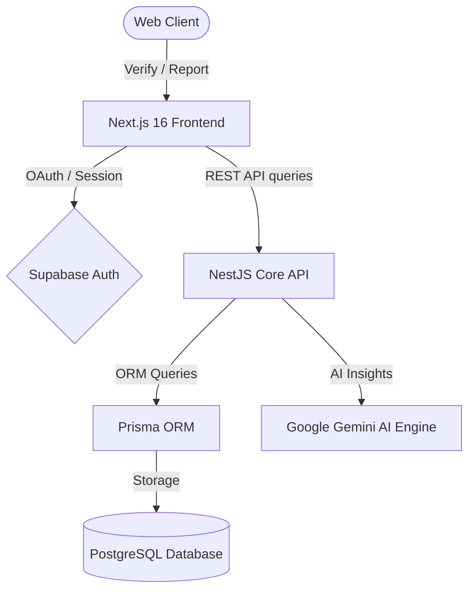

# 📱 Phone Koi - AI-Powered IMEI & Stolen Device Registry

Phone Koi is a premium, AI-driven mobile security and stolen device verification registry built to secure the second-hand mobile device market. The platform utilizes advanced real-time risk scores, dynamic trust algorithms, and Police GD cross-referencing to protect consumers and dealers against the acquisition of blacklisted or stolen electronics.

---

## ✨ System Architecture



Phone Koi relies on a clean, scalable decoupling of services:
*   **Frontend**: Next.js 16 (Turbopack) with custom indigo HSL glassmorphism, Framer Motion, Zustand, and TanStack React Query.
*   **Backend**: NestJS Core API architecture leveraging Prisma, PostgreSQL, and Gemini AI.
*   **Authentication**: Unified Supabase OAuth/JWT callback handler with contextual `redirectTo` redirects.

---

## 🚀 Key Features

### 1. 🔍 Smart IMEI Safety Verification
*   **Luhn Verification**: Instant mathematical check of IMEI format integrity.
*   **Safety Registry Lookup**: Queries active police logs and user-submitted gd files.
*   **Context Preservation Redirects**: Guest queries are held in state; users are routed to `/login?redirectTo=/check` and redirected back to their result dynamically after signing up.

### 2. 🔐 Multi-User Session & LocalStorage Isolation
*   **Dynamic Cache Keys**: User search logs and profile inputs are isolated strictly by email-suffixed keys (`search_history_${email}`, `profile_phone_${email}`).
*   **Prevention of Cross-User Leakage**: `localStorage` data loading is synchronized inside active authentication promises, ensuring distinct users on the same machine never see cached data from a previous session.

### 3. 🛡️ Dynamic Community Trust Standing
*   **Dynamic Trust Score**: Computes real-time user credibility index from `50%` (newly registered) up to `80%` (adding verified Phone & WhatsApp numbers), reaching `100%` with a physical home address.
*   **Police GD Audits**: Trust ratings automatically increase with approved reports (`+15%`) or drop dramatically (`-25%`) on rejected records during admin audits.

### 4. 📊 Cinematic User Dashboard & Activity Timeline
*   **Zero Mock Metrics**: 100% dynamic, live-calculated card indicators for reported devices, search checks, watchlist alerts, and localized danger alerts.
*   **Chronological Feed**: Merges reported devices, search log results, and safety alerts into a single dynamic, real-time chronological timeline.

### 5. 💳 Search Quota & bKash Subscription Gateway
*   **Check Quota Tracker**: Translates the traditional pricing layout into `"Check Quota (${searchesLeft} Left)"` sidebar alerts.
*   **bKash Checkout Modal**: Supports bKash Personal Send Money checkout verification flows with transaction code logging.

---

## 🛠️ Tech Stack

| Layer | Technologies |
| :--- | :--- |
| **Frontend Core** | Next.js 16 (Turbopack), React 19, TypeScript, Zustand |
| **Styling & Motion** | Tailwind CSS 4, Framer Motion, Lucide Icons |
| **Backend API** | NestJS Core, RxJS, TypeScript |
| **Database & ORM** | PostgreSQL, Prisma Client |
| **Authentication** | Supabase OAuth / Session Callbacks |
| **AI Integration** | Google Generative AI (Gemini Engine) |

---

## 📁 Repository Structure

```
phoneKoi/
├── antigravity-frontend/     # Next.js 16 App Directory (Client)
│   ├── src/
│   │   ├── app/              # Router (check, dashboard, pricing, profile)
│   │   ├── components/       # Glassmorphic layout cards and widgets
│   │   ├── store/            # Zustand persistent store
│   │   └── utils/            # Supabase ssr client wrappers
├── antigravity-backend/      # NestJS Core Framework (Server)
│   ├── src/
│   │   ├── users/            # Quota profiles & watchlist controllers
│   │   ├── reports/          # Stolen reports & verification handlers
│   │   └── imei/             # IMEI Luhn & Gemini verification engines
└── docker-compose.yml        # PostgreSQL & system orchestrations
```

---

## 🚀 Getting Started

### 1. Prerequisites
Ensure you have the following installed locally:
*   [Node.js](https://nodejs.org/) (v20 or higher)
*   [Docker & Compose](https://www.docker.com/)

### 2. Base Infrastructure
Spin up the local PostgreSQL database:
```bash
docker-compose up -d
```

### 3. Backend Setup
Configure and start the NestJS backend:
```bash
cd antigravity-backend
cp .env.example .env     # Update your DATABASE_URL and GEMINI_API_KEY
npm install
npx prisma db push      # Migrate and push SQL schemas
npm run start:dev
```

### 4. Frontend Setup
Configure and start the Next.js development server:
```bash
cd ../antigravity-frontend
cp .env.local.example .env.local   # Update your SUPABASE credentials
npm install
npm run dev
```

The frontend dev server will be active at `http://localhost:3000` and backend controllers at `http://localhost:4000`.

---

## 📄 License
This project is UNLICENSED. Feel free to clone and build locally!
